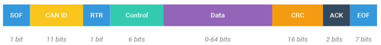
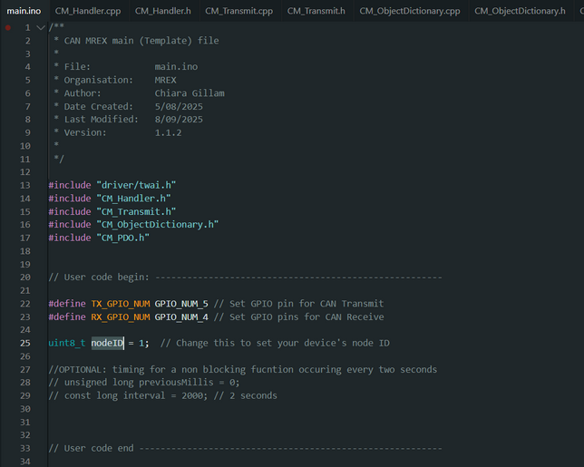
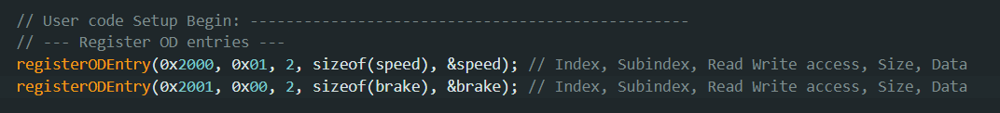

# CAN MREX

CAN MREX is a CAN wrapper that is intended to adhere to most of the CAN open standards however it is specifically designed for use on the MREx locomotive

## Also see
[MREx Ultra Node Tool](https://github.com/Monash-Railway-Express/MREx_Ultra_Node_Tool) - A tool to program nodes and change variables mid operation from a gui on a computer

[MREx Dashboard](https://github.com/Monash-Railway-Express/MREx_Dashboard) - A dashboard to view recorded data from the can bus for analysis.

## Helpful resources:

[Simple intro](https://www.csselectronics.com/pages/can-bus-simple-intro-tutorial) \- Good for first read  
[Simple CAN Open intro and tutorial](https://www.csselectronics.com/pages/canopen-tutorial-simple-intro) \- Good for learning what CAN open is  
[Cia full documentation \- 301](https://drive.google.com/file/d/1tCV2txLUFJx90trWNNmzJAe_5B2B17_A/view)   
[Esp32 twai drivers](https://sourcevu.sysprogs.com/espressif/esp-idf/symbols/twai_general_config_t)

## CAN bus

The CAN bus is a standard framework for transmitting data mostly used in the automotive and industrial/manufacturing industries. CAN MREX is built on top of this standard.

## Data Frame Break down

**SOF**: The Start of Frame is a ‘dominant 0’ to tell the other nodes that a CAN node intends to talk.

**ID**: The ID is the frame identifier and in CAN MREX it is known as the **COB-ID**. It is used to specify what the message means, and who’s sending it. The ID also defines the priority: the lower the ID, the higher the message’s priority.

**RTR**: Not used in CAN MREX

**Control**: The Control contains the Identifier Extension Bit (IDE) which is a ‘dominant 0’ for 11-bit. It also contains the 4 bit Data Length Code (DLC) that specifies how many bytes of data will be in the message.

**Data**: The 8 bytes of data contain the actual information. The format will be determined by the COB-ID

**CRC**: The Cyclic Redundancy Check is for error detection.

**ACK**: The ACK slot indicates if the node has acknowledged and received the data correctly.

**EOF**: The EOF marks the end of the CAN frame.

**You only really need to worry about ID and data.**

## Nodes

Each microcontroller that's connected to the CAN bus is called a node. Each node has it's own node ID. Most of the communication between different nodes requires their node IDs. It’s how we send things addressed to specific nodes and how we listen out for signals specific nodes are sending.

## IDs, COB-IDs and Functions

Everything sent on the can bus will adhere to one of the following function methods:

| Function | Purpose |
| ----- | ----- |
| [**NMT (Network Management)**](nmt) | Controls node states (e.g. Operational, Preoperational, Stopped). Sent by the **Node manager** to manage other nodes. |
| [**EMCY (Emergency)**](emcy) | Broadcasts fault conditions instantly. Used for fast error reporting. |
| [**TPDO (Transmit)**](pdos) | Sends real-time process data (e.g. sensor values, target speed) from node to bus. Use this for data we want to monitor constantly. |
| [**RPDO (Receive)**](pdos) | Receives process data (e.g. actuator commands) from bus to node. It will look out for specified TPDOs and take that from the bus into the node. |
| [**SDO**](sdos) | Sends structured data (e.g. config parameters) from node to another with a confirmation (Client server model). Can also request data from another node. |
| [**Heartbeat / Node Guarding**](heartbeat) | Monitors node presence and status. Detects if a node goes offline or fails. |

The ID of the message follows the following rules:
| Function | Function Code (Hex) | COB-ID Formula | COB-ID Range |
| ----- | ----- | ----- | ----- |
| NMT | 0x000 | Fixed | 0x000 |
| EMCY | 0x081 | 0x080 \+ Node ID | 0x081–0x0FF |
| TPDO1 | 0x180 | 0x180 \+ Node ID | 0x180–0x1FF |
| RPDO1 | 0x200 | 0x200 \+ Node ID | 0x200–0x27F |
| TPDO2 | 0x280 | 0x280 \+ Node ID | 0x280–0x2FF |
| RPDO2 | 0x300 | 0x300 \+ Node ID | 0x300–0x37F |
| TPDO3 | 0x380 | 0x380 \+ Node ID | 0x280–0x2FF |
| RPDO3 | 0x400 | 0x400 \+ Node ID | 0x300–0x37F |
| TPDO4 | 0x480 | 0x480 \+ Node ID | 0x280–0x2FF |
| RPDO4 | 0x500 | 0x500 \+ Node ID | 0x300–0x37F |
| SDO Tx | 0x600 | 0x600 \+ Node ID | 0x580–0x5FF |
| SDO Rx | 0x580  | 0x580 \+ Node ID | 0x600–0x67F |
| Heartbeat | 0x700 | 0x700 \+ Node ID | 0x700–0x77F |

## Example Frame

**Warning the indexes are little endian coded \!\!**

| \[ID\] | \[data\] |
| :---- | :---- |
| \[0x602\] | \[2F 01 00 00 01 00 00 00\] |

This is a SDO request sent to node 2 \[0x600 \+ node ID\] , requesting 1 byte of data be sent \[2F\] to index 0x0001 \[01 00\]  subindex 0x00 \[00\]. The data being sent is simply the number one \[01 00 00 00\]. (This is further explained in SDO section) You won't have to worry about little endian coding, the function's you'll be using will do this all for you.

# Physical CAN Network

## Node setup

Nodes must be set up in one long daisy chain. They will be connected by a twisted pair shielded cable. They will also be terminated at each end of the chain with a 120ohm resistor to prevent deflection.

## Connectors and Cabling 

 

[This link](https://docs.google.com/document/d/1z_m1jUXGCUGbTQQ1tjzIbztrTMvj-k5NUkE4eM-gYQw/edit?tab=t.0#heading=h.aarlihveemr) provides a deeper insight

## Node Overview

This is a table summarising all of the data arriving and leaving from each node. It also shows what Node ID each node is and what it does.  
[https://docs.google.com/spreadsheets/d/1OaXG5B06xnvpNkGQIkrtbM\_n-pCCqvnd99yezD7YYoQ/edit?gid=0\#gid=0](https://docs.google.com/spreadsheets/d/1OaXG5B06xnvpNkGQIkrtbM_n-pCCqvnd99yezD7YYoQ/edit?gid=0#gid=0) 

## CAN parameters

We will be using CAN 2.0  
The timing will be 500kb/s  
We will be using the standard 11 bit identifiers  
Bitrate and timing configuration?

## Operating modes

These are changed by the NMT controller. There are three main operating modes. **Stopped** means the node is stopped and in a safety mode. All variables and controls  will be set into a safe position (motor off, brakes on etc.). The node cannot send or receive anything other than a message from the NMT controller or its heartbeat. Next is **preoperational** which is still a “safe mode” however in this mode things in the object dictionary can be changed over SDOs. PDOs are still not active. The last mode is **Operational** in which you can do everything the node would usually do.

## Boot up protocol

The main controller is set as the NMT controller. This node will start in the “not operational” state and wait for a switch to be turned to preoperational. It will then set each node in the network to pre operational state. Each node will do a self check and ensure that everything is okay. If everything is okay, you can now switch to opertaional state. From here the train will function fully.

# Software

In order to use CAN MREX you will be pulling the CAN MREX github repository and building your projects within a copy of the MAIN folder.  
[https://github.com/Monash-Railway-Express/CAN\_MREx](https://github.com/Monash-Railway-Express/CAN_MREx)   
 

You should be able to do everything you need to do within the main.ino file. I would suggest renaming this file to your own project file name along with the copied main folder.

CAN MREx has been designed so that when there are updates to the software your main.ino file will not need to change. All you'll need to do is drop all the new files into your project folder and you're good to go.

All code you can configure/ change will be within User code begin and User code end areas.  
In this documentation we will go through functions you can call to use functionalities of CAN MREX such as the one below:  
  
   registerODEntry(0x2000, 0x01, 2, sizeof(uint16\_t), \&speed);

**Please make sure that when you’re writing code for CAN bus that you write non blocking code for ease of implementation.**  

 

This is an example where we only update the brakes every 100ms so that the CANhandler can run as much as possible and so we’re not wasting cycles on checking if the state has changed.

**Also please make sure you are using uint8\_t, uint16\_t and unit32\_t for variables cause the can bus only accepts unsigned ints. Talk to me if you’re worried about this.**

# Object Dictionary

The object dictionary is extremely important in how CAN MREX operates. It is essentially where all variables that are being sent and received on the CAN bus are stored. This allows us to scale things in a powerful way. 

Below is the basic structure of the object dictionary 

| Index | Subindex | Permissions | Size | Data |
| :---- | :---- | :---- | :---- | :---- |
| 2 byte value e.g 0x1000 | 1 byte value  e.g 0x01 | 0 \= Read only, 1 \= Write only,  2 \= Read Write | Size of data being stored (should be less than or equal to 8 bytes) | Where the data is stored |

The index and subindex are essentially the address of the variable. Permission allows us to protect certain variables. Size ensures there’s no lost or corrupted data.

## Example set up:

1. Initialise variables you want in the object dictionary. They must be of byte size 1, 2 or 4. (uint8\_t, uint16\_t, uint32\_t). This allows you to access the variables normally in your program.  Ensure they are unsigned integers\!\!\! Talk to me if you want to use floats or negative numbers we can work something out.   

2. Register the OD entries using the above table to help identify what variables you need to pass to the function. Do this in the setup

## Object Dictionary lookup 

[This](https://docs.google.com/spreadsheets/d/1OaXG5B06xnvpNkGQIkrtbM_n-pCCqvnd99yezD7YYoQ/edit?gid=1912354743#gid=1912354743) is the link to the object dictionary look up. If you want make a new object dictionary entry please put it in here first and under any nodes that use it.

If you need inspiration for what index to use for your varaibles this could be helpful:

[Myostat](https://docs.myostat.ca/cm1-e/user-guide/object-dictionary#ObjectDictionary-0x606C:Speedactualvalue) 

# Transmit types

## SDOs 

**Purpose**: Used for configuration of parameters that we need to ensure are updated successfully every time. For example the cruise control on/off switch

It can be described as a **Client-server model**  
An SDO request is sent out to a specific node. It can either ask to change a value in that node’s object dictionary or ask to know what value is stored at a certain address (index, subindex). That node will then either confirm that it updated its value, return what was at the address requested or cause an error.

### Data format

This stuff is mostly abstracted away but could be worth reading.

| Byte | Purpose |
| ----- | ----- |
| 0 | Command specifier (e.g., read/write) |
| 1–2 | Index (object dictionary) |
| 3 | Subindex |
| 4–7 | Data (up to 4 bytes for expedited transfer) |

### Client → Server (SDO Request) Command Specifiers

| Command Byte | Meaning | Data Size |
| :---- | :---- | :---- |
| 0x2F | Write 1 byte (3 unused) | 1 byte |
| 0x2B | Write 2 bytes (2 unused) | 2 bytes |
| 0x23 | Write 4 bytes (0 unused) | 4 bytes |
| 0x40 | Read request | 0 bytes |

### Server → Client (SDO Response) Command Specifiers

| Command Byte | Meaning | Data Size |
| :---- | :---- | :---- |
| 0x60 | Write confirmation | 0 bytes |
| 0x4F | Read response (1 byte) | 1 byte |
| 0x4B | Read response (2 bytes) | 2 bytes |
| 0x43 | Read response (4 bytes) | 4 bytes  |

### Example set up:

**SDO write request**  

| Node ID | Targeted node | Index | Subindex | Value | Size of value |
| :---- | :---- | :---- | :---- | :---- | :---- |
| Own node id | The node you want to write to | The index in the targeted nodes OD you want to write to  | The subindex | The value you want to write | The size of that value (1, 2 or 4 bytes)  |

CAN MREX automatically will deal with whether it’s 1,2 or 4 bytes long to ensure that minimum processing time is reached.   
Implement abort codes for debugging.

**SDO read request**

| Node ID | Targeted node | Index | Subindex |
| :---- | :---- | :---- | :---- |
| Own node id | The node you want to write to | The index in the targeted nodes OD you want to write to  | The subindex |

Since it always returns a 32 bit value you will need to typecast it to have it in the format you want. You must put it into a temporary value before typecasting it as otherwise you can cause memory leaks and undefined behaviour.

**SDO Confirmations/responses**  
The receiving node will automatically update its Object dictionary and confirm this when it receives an SDO write request. It will also automatically send back its data from an SDO read request. You do not need to do anything to receive this function as long as the handleCAN() function is repeatedly polled. 

## PDOs

**Purpose**: High‑speed, real‑time data transfer with no extra protocol overhead.
TPDO – Transmit PDO: node acts as a producer (sends data).  
RPDO – Receive PDO: node acts as a consumer (receives data).  
**Descriptors**:  
Each PDO has Communication Parameters (COB‑ID, transmission type, timing, etc.)  
And Mapping Parameters (which Object Dictionary entries and how many bits/bytes each consumes). Both are mandatory for each PDO.

PDOs are the basis for how real time, continuous data is sent. It has a higher priority on the bus than SDOs and will be used for things like real time control of brakes and motors and also receiving sensor data.  
The PDO is mapped at the start of your program. TPDOs tell CAN MREX to send data from chosen places in the object dictionary on the COB-ID you specify. RPDOs listen out for a specified COB-ID and map that back to your object dictionary.

### Data format

| Byte | Purpose |
| ----- | ----- |
| 0–7 | Application-specific data |

###  

Each node has 4 RPDOs and 4 TPDOs

COB ID ranges for TPDOS and RPDOS are seen at the start of the document

### Tables

### Configure TPDO

| TPDO num (pdoNum) | COB-ID | Transmission type | Inihibit | eventMs |
| :---- | :---- | :---- | :---- | :---- |
| Selects which PDO channel to configure (0–3) 0 for TPDO1 / RPDO1 | CAN identifier used for the PDO.  Bit 31 disables the PDO if set. | Transmission type: defines when the PDO is sent 255 \- asynchronous **(what we’ll be using)**  1 \- (synchronous every cycle) (not implemented) | Minimum time (in ms) between transmissions to prevent flooding | Optional timer for periodic transmission 0 (disabled), 100 (send every 100 ms) |

### 

### 

### Configure RPDO

| RPDO num (pdoNum) | COB-ID | Transmission type | Inihibit |
| :---- | :---- | :---- | :---- |
| Selects which PDO channel to configure (0–3) 0 for TPDO1 / RPDO1 | CAN identifier used for the PDO.  Bit 31 disables the PDO if set. | Transmission type: defines when the PDO is expected  **255 \- asynchronous (what we’ll be using)**  1 \- (synchronous every cycle) (not implemented) | Minimum time (in ms) between transmissions to prevent flooding |

### Map TPDO/RPDO

| pdoNum | entries | count |
| :---- | :---- | :---- |
| Selects which PDO channel to configure (0–3) 0 for TPDO1 / RPDO1 | Pointer to array of PdoMapEntry structs defining mapped variables { {0x0001, 0x00, 8}, {0x1000, 0x00, 8} } | Number of mapped entries in the array 1, 2, up to 8 |

### PDOMapEntry Struct

  PdoMapEntry rpdoEntries\[\] \= {  
    {0x2000, 0x01, 16},  // Example: index 0x2000, subindex 1, 16 bits  
    {0x2001, 0x00, 8}    // Example: index 0x2001, subindex 0, 8 bits  
  };

---

Don’t forget that the maximum amount of bytes allowed in one data transfer is 8 bytes so keep that in mind when creating this struct.

### Example set up:

**TPDO set up**  

In this example we have mapped TPDO1 to send from COB ID 181 (Its node 1). It is sending the values from index 0x2000, 0x01 and 0x2001, 0x00 in the object dictionary. It is set up to send every 1000ms with an inhibit of 100ms. 

CAN MREX will automatically send the values in your object dictionary as long as handleCAN() function is continuously being polled. It will also only send the data if it’s changed values which frees up the can network.

If you don’t want to send it with a 1000ms timer you could also have it so that it sends when you want it to using the markTpdoDirty(pdonum) Function. You pass the TPDO number you want to mark as dirty and next time the handleCAN() function is called. You can also have both a timer and the marktpdo dirty function working together. This is where the inhibit timer could come in handy.  

This corresponds to TPDO 1

**RPDO set up**  

 

In this example you can see that we have configured RPDO1 to receive from COB ID 0x181 asynchronously and without inhibiting how often it receives that message. We then set up the Map entry so that we have two OD entries being mapped to this RPDO (brake and speed).  We then officially map the entry with mapRPDO mapping RPDO1 to two values in the OD.  
CAN MREX will automatically receive and update the values in your object dictionary as long as handleCAN() function is continuously being polled.

## NMT 

All nodes in the network will be controlled by a node deemed the “NMT Controller” This helps with process flow. The NMT Controller will control what state each node is in. There are three states that a node can be in. 0x02 is the stopped state. All nodes except the NMT controller will start in this state. The NMT controller can then send signals to change each node to whatever state is needed at any time.   
High priority message on the bus. This means nodes will react to this message before anything else.

| Byte | Purpose |
| ----- | ----- |
| 0 | Command (e.g., Start, Stop, Reset) |
| 1 | Node ID |

| Command Specifier | Meaning |
| :---- | :---- |
| 0x01 | Start remote node |
| 0x02 | Stop remote node |
| 0x80 | Enter pre-operational |
| 0x81 | Reset node |
| 0x82 | Reset communication (not implemented) |

### Example set up:

Command, Node ID

## Heartbeat  {#heartbeat}

Heartbeats will be sent out automatically by every node every second. A single node will double as the heartbeat consumer and will keep track of whether nodes are alive.

| Byte | Purpose |
| ----- | ----- |
| 0 | Node state (e.g., operational, pre-operational) |

## EMCY (0x80)

Emergency messages are crucial on our locomotive. There is fast error reporting as it is a high priority message on the bus. This means nodes will react to this message before anything else.

### Sending an emergency message:

| Byte | Purpose |
| ----- | ----- |
| 0 | Error priority (0 for major,  1 for minor)  |
| 1 | Node location |
| 2-5 | Error code (4 bytes) (little endian) I might change this for ease of reading |

Byte 1 of the error code corresponds to what type of error it is and the rest is up to whoever creates it. A list of all error codes can be found here:  
[https://docs.google.com/spreadsheets/d/1OaXG5B06xnvpNkGQIkrtbM\_n-pCCqvnd99yezD7YYoQ/edit?gid=1817306757\#gid=1817306757](https://docs.google.com/spreadsheets/d/1OaXG5B06xnvpNkGQIkrtbM_n-pCCqvnd99yezD7YYoQ/edit?gid=1817306757#gid=1817306757) 

| Byte 1 Value | Description |
| :---- | :---- |
| 0x00 | CAN MREx fault |
| 0x01 | Motor fault |
| 0x02 | Brake fault |
| 0x03 | Battery fault |

### Minor and major faults
Minor faults will simply end up as a message on the can bus and will be displayed on the screen. After a ceratin amount of minor faults (currently 10) a major fault will be triggered.
Major faults will cause an emergency stop.

# Testing process

The can bus should be tested in an isolated environment on a test bench to ensure all commands and functionalities are correct and filtering is working as intended.

